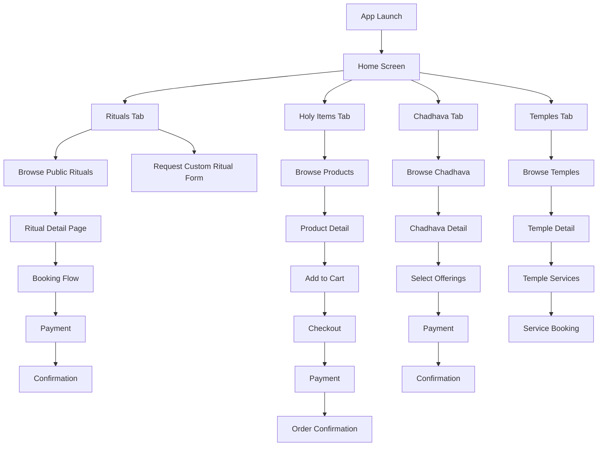

# Design Document

## Overview

The Mandir Mitra UI/UX Redesign transforms the spiritual services platform into a premium, modern mobile application that honors tradition while embracing contemporary design excellence. The design philosophy centers on creating a serene, engaging, and deeply spiritual experience through careful attention to visual hierarchy, color psychology, and user-centered interaction patterns.

### Design Principles

1. **Spiritual Serenity**: Create a calming, meditative atmosphere through soft colors, generous spacing, and smooth animations
2. **Premium Quality**: Elevate the experience with high-quality imagery, refined typography, and polished interactions
3. **Accessibility First**: Ensure all devotees can access services through WCAG AA compliance and inclusive design
4. **Performance**: Optimize for speed with lazy loading, caching, and efficient rendering
5. **Trust & Authenticity**: Build confidence through verified badges, reviews, and transparent information

### Target Platforms

- **Primary**: iOS and Android mobile devices (360px - 480px width)
- **Secondary**: Tablets (768px - 1024px width)
- **Future**: Responsive web application (1024px+ width)

## Architecture

### Information Architecture

```
Mandir Mitra App
├── Home (Dashboard)
│   ├── Hero Banner Carousel
│   ├── Quick Stats Card
│   ├── Service Categories Grid
│   ├── Featured Rituals
│   ├── Aashirwad Box Showcase
│   ├── Temple Partners Preview
│   └── Spiritual Insights Feed
│
├── Rituals (Browse & Custom)
│   ├── Custom Ritual Order Form (Prominent CTA)
│   ├── Search & Filters
│   ├── Category Sections
│   │   ├── Everyday Rituals
│   │   ├── Life Benefit Pujas
│   │   ├── Dosh Nivaran
│   │   └── Special Occasions
│   └── Ritual Detail Pages
│
├── Holy Items (Ecommerce)
│   ├── Hero Banner
│   ├── Category Navigation
│   ├── Product Grid (2 columns)
│   ├── Filters & Sort
│   ├── Product Detail Pages
│   └── Shopping Cart
│
├── Chadhava (Offerings)
│   ├── Category Filters
│   ├── Featured Chadhava Banners
│   ├── Daily Deity Chadhava
│   ├── Special Occasion Chadhava
│   ├── Life Benefit Chadhava
│   └── Prasad Offerings
│
└── Temples (Exploration)
    ├── Featured Temple Spotlight
    ├── Category Chips
    ├── Temple Grid
    └── Temple Detail Pages
        ├── Chadhava Services
        ├── Puja Services
        ├── Live Darshan
        └── Aartis
```


### Navigation Flow



### Screen Hierarchy

**Level 1: Bottom Navigation (Always Visible)**
- Home, Rituals, Holy Items, Chadhava, Temples

**Level 2: Main Content Screens**
- Dashboard views, listing pages, category pages

**Level 3: Detail Pages**
- Ritual details, product details, temple details

**Level 4: Action Flows**
- Booking forms, checkout, payment

**Level 5: Confirmation & Feedback**
- Success screens, order tracking

## Components and Interfaces

### Design System Tokens

#### Color Palette

**Primary Colors**
```css
--sacred-teal: #1A5F5F;           /* Main brand color */
--sacred-teal-light: #2A7F7F;     /* Hover states */
--sacred-teal-dark: #0A4F4F;      /* Active states */
--bright-orange: #FF6B35;         /* CTAs, primary actions, backgrounds */
--bright-orange-light: #FF8555;   /* Hover states */
--bright-orange-dark: #E55525;    /* Active states */
--bright-orange-text: #E55525;    /* For text on light backgrounds (WCAG AA: 4.5:1) */
--bright-orange-accessible: #D94515; /* For critical text (WCAG AAA: 7:1) */
--divine-gold: #D4AF37;           /* Accents, highlights */
```

**Background Colors**
```css
--cream-bg: #FBF8F3;              /* Main background (from reference) */
--light-cream: #FFFCF7;           /* Lighter variant */
--pure-white: #FFFFFF;            /* Cards, content areas */
--soft-beige: #F5F0E8;            /* Secondary background */
--muted-gold: #E8D4A2;            /* Subtle highlights */
```

**Text Colors**
```css
--deep-brown: #4A3426;            /* Primary text */
--sacred-grey: #6B6B6B;           /* Secondary text */
--light-grey: #9E9E9E;            /* Tertiary text */
--warm-terracotta: #C97855;       /* Accent text */
```

**Functional Colors**
```css
--success-green: #2D6E4E;
--success-green-light: #E8F5E9;
--warning-amber: #D97826;
--warning-amber-light: #FFF3E0;
--error-red: #C04848;
--error-red-light: #FFEBEE;
--info-teal: #1A7B8A;
--info-teal-light: #E0F7FA;
```

#### Typography Scale

**Font Families**
```css
--font-heading: 'Playfair Display', serif;
--font-body: 'Inter', sans-serif;
--font-accent: 'Montserrat', sans-serif;
--font-devanagari: 'Noto Sans Devanagari', sans-serif;
```

**Font Sizes (Mobile)**
```css
--text-h1: 28px;      /* Page titles */
--text-h2: 24px;      /* Section headers */
--text-h3: 20px;      /* Card titles */
--text-h4: 18px;      /* Subsection headers */
--text-large: 18px;   /* Emphasized body */
--text-base: 16px;    /* Standard body */
--text-small: 14px;   /* Secondary info */
--text-caption: 12px; /* Labels, metadata */
```

**Font Weights**
```css
--weight-regular: 400;
--weight-medium: 500;
--weight-semibold: 600;
--weight-bold: 700;
```

**Line Heights**
```css
--line-tight: 1.2;    /* Headings */
--line-normal: 1.5;   /* Body text */
--line-relaxed: 1.75; /* Long-form content */
```

#### Spacing System (8px Grid)

```css
--space-xs: 4px;
--space-sm: 8px;
--space-md: 16px;
--space-lg: 24px;
--space-xl: 32px;
--space-2xl: 48px;
--space-3xl: 64px;
```

#### Border Radius

```css
--radius-sm: 4px;     /* Small elements */
--radius-md: 8px;     /* Cards, buttons */
--radius-lg: 12px;    /* Large cards */
--radius-xl: 16px;    /* Hero sections */
--radius-full: 9999px; /* Pills, avatars */
```

#### Shadows

```css
--shadow-sm: 0 1px 2px rgba(0, 0, 0, 0.05);
--shadow-md: 0 4px 6px rgba(0, 0, 0, 0.07);
--shadow-lg: 0 10px 15px rgba(0, 0, 0, 0.1);
--shadow-xl: 0 20px 25px rgba(0, 0, 0, 0.15);
--shadow-divine: 0 4px 20px rgba(212, 175, 55, 0.3); /* Gold glow */
```


### Core UI Components

#### 1. Bottom Navigation Bar

**Structure:**
```
┌─────────────────────────────────────────────────────────┐
│  [🏠]    [🙏]     [🛍️]     [🪔]     [🛕]              │
│  Home   Rituals  Holy Items Chadhava  Temples           │
└─────────────────────────────────────────────────────────┘
```

**Specifications:**
- Height: 64px
- Background: Pure White (#FFFFFF)
- Active tab: Bright Orange icon + text (#FF6B35)
- Inactive tabs: Sacred Grey (#6B6B6B)
- Icon size: 24x24px
- Text: 12px, Montserrat Medium
- Shadow: shadow-md for elevation
- Touch target: 44x44px minimum

**States:**
- Default: Grey icon + text
- Active: Bright Orange icon + text with subtle scale (1.05)
- Press: Scale 0.95 with haptic feedback

#### 2. Button Components

**Primary CTA Button**
```css
background: #FF6B35;              /* Bright orange */
color: #FFFFFF;
padding: 16px 24px;
border-radius: 8px;
font: 14px Montserrat Semibold;
text-transform: uppercase;
letter-spacing: 0.05em;
box-shadow: 0 4px 12px rgba(255, 107, 53, 0.3);
```

**States:**
- Hover: background #FF8555, lift 2px, increase shadow
- Press: Scale 0.98, background #E55525
- Disabled: Opacity 0.5, no interaction

**Secondary Button**
```css
background: transparent;
border: 2px solid #1A5F5F;
color: #1A5F5F;
padding: 14px 24px;
border-radius: 8px;
font: 14px Montserrat Semibold;
```

**Ghost Button**
```css
background: transparent;
color: #1A5F5F;
padding: 12px 16px;
font: 14px Montserrat Medium;
```

#### 3. Card Components

**Standard Card**
```css
background: #FFFFFF;
border-radius: 12px;
padding: 16px;
box-shadow: 0 2px 8px rgba(0, 0, 0, 0.06);
border: 1px solid rgba(0, 0, 0, 0.04);
```

**Ritual Card (Vertical)**
```
┌──────────────────┐
│  [Image 16:9]    │
├──────────────────┤
│  Ritual Name     │
│  Temple Name     │
│  ⭐ 4.8 (235)    │
│  From ₹301       │
│  [BOOK NOW]      │
└──────────────────┘
```

**Product Card (Holy Items)**
```
┌──────────────────┐
│  [Image 1:1]     │
│  [❤️ Wishlist]   │
├──────────────────┤
│  Product Name    │
│  ⭐⭐⭐⭐⭐        │
│  ₹499  [🛒]      │
└──────────────────┘
```

**Package Selection Card**
```
┌─────────────────────────────────┐
│  👥 SHARED PACKAGE    [✓]       │
│  ₹301/person • 10 participants  │
│  • Live streaming included      │
│  • Basic Aashirwad Box          │
│  • Shared ritual session        │
└─────────────────────────────────┘
```

**Specifications:**
- Selected state: Border 2px Divine Gold, background tint
- Hover: Lift 4px with shadow-lg
- Image aspect ratios: 16:9 (rituals), 1:1 (products), 4:3 (temples)

#### 4. Form Components

**Text Input**
```css
background: #FFFFFF;
border: 2px solid #E0E0E0;
border-radius: 8px;
padding: 12px 16px;
font: 16px Inter Regular;
color: #4A3426;
```

**States:**
- Focus: Border color #1A5F5F, shadow-md
- Error: Border color #C04848, error message below
- Success: Border color #2D6E4E, checkmark icon
- Disabled: Background #F5F5F5, opacity 0.6

**Dropdown/Select**
```css
background: #FFFFFF;
border: 2px solid #E0E0E0;
border-radius: 8px;
padding: 12px 16px;
font: 16px Inter Regular;
/* Chevron icon right-aligned */
```

**Checkbox**
```css
width: 20px;
height: 20px;
border: 2px solid #1A5F5F;
border-radius: 4px;
/* Checkmark in Divine Gold when selected */
```

**Radio Button**
```css
width: 20px;
height: 20px;
border: 2px solid #1A5F5F;
border-radius: 50%;
/* Inner circle in Divine Gold when selected */
```

#### 5. Search Bar

```
┌─────────────────────────────────────────┐
│  🔍  Search rituals, temples, items...  │
└─────────────────────────────────────────┘
```

**Specifications:**
- Height: 48px
- Background: #FFFFFF
- Border: 1px solid #E0E0E0
- Border radius: 24px (pill shape)
- Icon: 20x20px, Sacred Grey
- Placeholder: 16px Inter Regular, Light Grey
- Focus: Border color Sacred Teal, shadow-md

#### 6. Filter Chips

```
[All] [Everyday] [Life Benefits] [Dosh Removal]
```

**Specifications:**
- Height: 36px
- Padding: 8px 16px
- Border radius: 18px (pill)
- Font: 14px Montserrat Medium

**States:**
- Inactive: Background Temple Cream, text Deep Brown
- Active: Background Divine Gold, text White
- Hover: Scale 1.05

#### 7. Image Gallery Component

**Hero Image with Carousel**
```
┌─────────────────────────────────────┐
│  ←                              →   │
│                                     │
│     [Full-Screen Image]             │
│                                     │
│     • • • ○ •  [1/5]               │
└─────────────────────────────────────┘
```

**Features:**
- Swipeable horizontal navigation
- Smooth parallax effect on scroll
- Dot indicators at bottom
- Image counter overlay
- Double-tap to zoom
- Lightbox mode on tap

#### 8. Rating Component

```
⭐⭐⭐⭐⭐ 4.8 (235 reviews)
```

**Specifications:**
- Star size: 16px
- Filled stars: Divine Gold
- Empty stars: Light Grey
- Rating text: 14px Inter Semibold
- Review count: 14px Inter Regular, Sacred Grey

#### 9. Price Display

```
From ₹301
per person
```

**Specifications:**
- Price: 20px Inter Bold, Deep Brown
- "From" text: 12px Inter Regular, Sacred Grey
- "per person": 12px Inter Regular, Sacred Grey

#### 10. Badge Components

**Status Badges**
```css
/* Verified Badge */
background: #2D6E4E;
color: #FFFFFF;
padding: 4px 8px;
border-radius: 4px;
font: 12px Montserrat Semibold;

/* Most Popular Badge */
background: #D4AF37;
color: #FFFFFF;
padding: 4px 8px;
border-radius: 4px;
font: 12px Montserrat Semibold;
```


## Data Models

### User/Devotee Model

```typescript
interface Devotee {
  id: string;
  fullName: string;
  email: string;
  phoneNumber: string;
  dateOfBirth?: Date;
  profileImage?: string;
  
  // Spiritual Progress
  punyaMudra: number;
  bhaktiStreak: number;
  attendanceCount: number;
  devoteeLevel: 'Beginner' | 'Devotee' | 'Dedicated' | 'Enlightened';
  
  // Preferences
  preferredDeities: string[];
  preferredLanguage: 'en' | 'hi' | 'ta' | 'te';
  notificationPreferences: NotificationSettings;
  
  // Location
  address?: Address;
  
  // Timestamps
  createdAt: Date;
  lastLoginAt: Date;
}

interface NotificationSettings {
  ritualReminders: boolean;
  liveStreamingAlerts: boolean;
  shippingUpdates: boolean;
  specialOccasions: boolean;
  promotionalOffers: boolean;
}

interface Address {
  street: string;
  city: string;
  state: string;
  pincode: string;
  country: string;
}
```

### Ritual Model

```typescript
interface Ritual {
  id: string;
  name: string;
  slug: string;
  type: 'public' | 'custom';
  category: RitualCategory;
  
  // Description
  shortDescription: string;
  fullDescription: string;
  significance: string;
  benefits: string[];
  process: RitualStep[];
  
  // Media
  images: string[];
  videoUrl?: string;
  
  // Temple & Priest
  templeId: string;
  templeName: string;
  priestId: string;
  priestName: string;
  priestVerified: boolean;
  priestExperience: number;
  
  // Deity
  deities: string[];
  
  // Timing
  duration: number; // in minutes
  availableDates?: Date[];
  muhurat?: MuhuratTime[];
  
  // Packages
  packages: RitualPackage[];
  
  // Aashirwad Box
  aashirwadBox: AashirwadBoxDetails;
  
  // Ratings & Reviews
  averageRating: number;
  totalReviews: number;
  totalBookings: number;
  
  // Status
  isActive: boolean;
  isFeatured: boolean;
  
  // Timestamps
  createdAt: Date;
  updatedAt: Date;
}

type RitualCategory = 
  | 'everyday'
  | 'life-benefit'
  | 'dosh-nivaran'
  | 'special-occasion'
  | 'custom';

interface RitualStep {
  stepNumber: number;
  title: string;
  description: string;
  duration: number;
  icon?: string;
}

interface MuhuratTime {
  date: Date;
  startTime: string;
  endTime: string;
  isAuspicious: boolean;
}

interface RitualPackage {
  type: 'shared' | 'family' | 'personal';
  pricePerPerson: number;
  maxParticipants: number;
  features: string[];
  isPopular?: boolean;
}

interface AashirwadBoxDetails {
  type: 'basic' | 'premium' | 'divine';
  items: string[];
  deliveryDays: number;
  customizationOptions?: string[];
}
```

### Holy Item (Product) Model

```typescript
interface HolyItem {
  id: string;
  name: string;
  slug: string;
  category: ProductCategory;
  
  // Description
  shortDescription: string;
  fullDescription: string;
  specifications: Record<string, string>;
  
  // Media
  images: string[];
  videoUrl?: string;
  
  // Pricing
  price: number;
  originalPrice?: number;
  discount?: number;
  
  // Inventory
  inStock: boolean;
  stockQuantity: number;
  
  // Variants
  variants?: ProductVariant[];
  
  // Deity Association
  associatedDeities?: string[];
  
  // Ratings & Reviews
  averageRating: number;
  totalReviews: number;
  totalSales: number;
  
  // Metadata
  material?: string;
  dimensions?: string;
  weight?: string;
  isBlessed: boolean;
  
  // Status
  isActive: boolean;
  isFeatured: boolean;
  
  // Timestamps
  createdAt: Date;
  updatedAt: Date;
}

type ProductCategory = 
  | 'idols-statues'
  | 'rudraksha-malas'
  | 'sacred-books'
  | 'puja-items'
  | 'yantras'
  | 'incense-dhoop'
  | 'spiritual-jewelry'
  | 'blessed-artifacts';

interface ProductVariant {
  id: string;
  name: string;
  type: 'size' | 'material' | 'color';
  value: string;
  priceAdjustment: number;
  inStock: boolean;
}
```

### Chadhava Model

```typescript
interface Chadhava {
  id: string;
  name: string;
  slug: string;
  category: ChadhavaCategory;
  
  // Description
  description: string;
  significance: string;
  
  // Media
  images: string[];
  
  // Temple & Deity
  templeId: string;
  templeName: string;
  deityName: string;
  deityImage: string;
  
  // Offerings
  offeringTypes: OfferingType[];
  
  // Pricing
  basePrice: number;
  packages?: ChadhavaPackage[];
  
  // Timing
  availableDates?: Date[];
  nextAvailableDate: Date;
  
  // Video Proof
  videoDeliveryTime: number; // in hours
  
  // Multi-temple
  isMultiTemple: boolean;
  temples?: string[]; // temple IDs if multi-temple
  
  // Status
  isActive: boolean;
  isFeatured: boolean;
  
  // Timestamps
  createdAt: Date;
  updatedAt: Date;
}

type ChadhavaCategory = 
  | 'daily-deity'
  | 'special-occasion'
  | 'life-benefit'
  | 'prasad-offering';

interface OfferingType {
  id: string;
  name: string;
  icon: string;
  basePrice: number;
  quantityOptions: number[];
}

interface ChadhavaPackage {
  type: string;
  price: number;
  description: string;
}
```

### Temple Model

```typescript
interface Temple {
  id: string;
  name: string;
  slug: string;
  category: TempleCategory;
  
  // Description
  description: string;
  history: string;
  significance: string;
  
  // Media
  images: string[];
  virtualTourUrl?: string;
  
  // Location
  address: Address;
  coordinates: {
    latitude: number;
    longitude: number;
  };
  
  // Deity
  presidingDeity: string;
  otherDeities?: string[];
  
  // Timings
  openingHours: TempleTimings;
  
  // Services
  availableServices: {
    chadhava: boolean;
    pujas: boolean;
    liveDarshan: boolean;
    aartis: boolean;
  };
  
  // Live Darshan
  liveDarshanUrl?: string;
  liveDarshanSchedule?: DarshanSchedule[];
  
  // Festivals
  festivalsCelebrated: string[];
  
  // Rules
  dressCode?: string;
  specialInstructions?: string[];
  
  // Ratings & Reviews
  averageRating: number;
  totalReviews: number;
  
  // Verification
  isVerified: boolean;
  partnerSince: Date;
  
  // Status
  isActive: boolean;
  isFeatured: boolean;
  
  // Timestamps
  createdAt: Date;
  updatedAt: Date;
}

type TempleCategory = 
  | 'shaktipeeth'
  | 'jyotirlinga'
  | 'char-dham'
  | 'popular'
  | 'ancient';

interface TempleTimings {
  monday: TimeSlot;
  tuesday: TimeSlot;
  wednesday: TimeSlot;
  thursday: TimeSlot;
  friday: TimeSlot;
  saturday: TimeSlot;
  sunday: TimeSlot;
}

interface TimeSlot {
  open: string;
  close: string;
  isClosed: boolean;
}

interface DarshanSchedule {
  dayOfWeek: string;
  times: string[];
}
```

### Booking Model

```typescript
interface Booking {
  id: string;
  referenceId: string; // MM-12345678
  devoteeId: string;
  
  // Type
  bookingType: 'ritual' | 'chadhava' | 'temple-service';
  
  // Related Entity
  ritualId?: string;
  chadhavaId?: string;
  templeServiceId?: string;
  
  // Details
  ritualName: string;
  templeName: string;
  
  // Package
  packageType: 'shared' | 'family' | 'personal';
  participants: Participant[];
  
  // Deity Preference
  selectedDeities: string[];
  
  // Timing
  scheduledDate: Date;
  scheduledTime: string;
  duration: number;
  
  // Aashirwad Box
  aashirwadBox: {
    type: string;
    items: string[];
    customizations?: string[];
    shippingAddress: Address;
    trackingNumber?: string;
    estimatedDelivery: Date;
    deliveryStatus?: 'pending' | 'shipped' | 'delivered' | 'lost' | 'damaged';
    deliveryPhotoUrl?: string;
  };
  
  // Special Instructions
  specialInstructions?: string;
  prayerMessage?: string;
  
  // Pricing
  subtotal: number;
  taxes: number;
  discount?: number;
  promoCode?: string;
  total: number;
  
  // Payment
  paymentId: string;
  paymentStatus: 'pending' | 'completed' | 'failed' | 'refunded' | 'partially-refunded';
  paymentMethod: string;
  paymentAttempts?: PaymentAttempt[];
  
  // Refund
  refundAmount?: number;
  refundStatus?: 'pending' | 'processed' | 'failed';
  refundTransactionId?: string;
  refundReason?: string;
  
  // Cancellation
  cancellationDate?: Date;
  cancellationReason?: string;
  cancellationInitiatedBy?: 'devotee' | 'temple' | 'system';
  
  // Rescheduling
  rescheduleHistory?: RescheduleRecord[];
  
  // Status
  status: 'upcoming' | 'in-progress' | 'completed' | 'cancelled' | 'rescheduled';
  
  // Media
  liveStreamUrl?: string;
  liveStreamStatus?: 'scheduled' | 'live' | 'completed' | 'failed';
  recordedVideoUrl?: string;
  chadhavaVideoUrl?: string;
  videoProofStatus?: 'pending' | 'ready' | 'delayed' | 'unavailable';
  
  // Support
  customerSupportTickets?: string[]; // ticket IDs
  
  // Timestamps
  createdAt: Date;
  updatedAt: Date;
  completedAt?: Date;
}

interface PaymentAttempt {
  attemptNumber: number;
  timestamp: Date;
  paymentMethod: string;
  status: 'success' | 'failed';
  errorCode?: string;
  errorMessage?: string;
}

interface RescheduleRecord {
  originalDate: Date;
  newDate: Date;
  rescheduledAt: Date;
  fee: number;
  reason?: string;
}

interface Participant {
  name: string;
  relation?: string;
  dateOfBirth?: Date;
}
```

### Cart Model

```typescript
interface Cart {
  id: string;
  devoteeId: string;
  items: CartItem[];
  
  // Pricing
  subtotal: number;
  taxes: number;
  shippingCharges: number;
  total: number;
  
  // Timestamps
  createdAt: Date;
  updatedAt: Date;
}

interface CartItem {
  id: string;
  itemType: 'holy-item' | 'ritual' | 'chadhava';
  itemId: string;
  itemName: string;
  itemImage: string;
  
  // Quantity (for holy items)
  quantity?: number;
  
  // Variant (for holy items)
  selectedVariant?: {
    type: string;
    value: string;
  };
  
  // Package (for rituals)
  selectedPackage?: string;
  
  // Pricing
  unitPrice: number;
  totalPrice: number;
  
  // Timestamps
  addedAt: Date;
}
```

### Review Model

```typescript
interface Review {
  id: string;
  devoteeId: string;
  devoteeName: string;
  devoteeImage?: string;
  
  // Related Entity
  entityType: 'ritual' | 'holy-item' | 'temple' | 'chadhava';
  entityId: string;
  
  // Review Content
  rating: number; // 1-5
  title: string;
  comment: string;
  photos?: string[];
  
  // Verification
  isVerified: boolean;
  bookingId?: string;
  
  // Helpfulness
  helpfulCount: number;
  
  // Status
  isApproved: boolean;
  
  // Timestamps
  createdAt: Date;
  updatedAt: Date;
}
```

### Promo Code Model

```typescript
interface PromoCode {
  id: string;
  code: string;
  type: 'percentage' | 'fixed-amount' | 'credit';
  
  // Discount
  discountValue: number; // percentage (10 = 10%) or fixed amount (100 = ₹100)
  maxDiscount?: number; // maximum discount cap for percentage type
  minOrderValue?: number; // minimum order value to apply
  
  // Validity
  validFrom: Date;
  validUntil: Date;
  isActive: boolean;
  
  // Usage Limits
  maxUsageTotal?: number; // total times code can be used
  maxUsagePerUser?: number; // times each user can use
  currentUsageCount: number;
  
  // Restrictions
  applicableFor?: ('ritual' | 'holy-item' | 'chadhava')[]; // if null, applies to all
  firstTimeUserOnly?: boolean;
  specificRituals?: string[]; // ritual IDs
  specificTemples?: string[]; // temple IDs
  
  // Metadata
  description: string;
  createdBy: string;
  
  // Timestamps
  createdAt: Date;
  updatedAt: Date;
}

interface PromoCodeUsage {
  id: string;
  promoCodeId: string;
  devoteeId: string;
  bookingId: string;
  discountApplied: number;
  usedAt: Date;
}
```

### Referral Model

```typescript
interface Referral {
  id: string;
  referrerId: string; // devotee who referred
  referredId?: string; // devotee who was referred (null until signup)
  referralCode: string; // unique code for referrer
  
  // Status
  status: 'pending' | 'signed-up' | 'completed' | 'expired';
  
  // Rewards
  referrerReward: number; // ₹100
  referredReward: number; // ₹100
  referrerRewardStatus: 'pending' | 'credited';
  referredRewardStatus: 'pending' | 'credited';
  
  // Conditions
  referredFirstBookingId?: string; // booking that triggered reward
  referredFirstBookingDate?: Date;
  
  // Timestamps
  createdAt: Date;
  signedUpAt?: Date;
  completedAt?: Date;
  expiresAt: Date; // 90 days from creation
}
```

### Gamification Models

```typescript
interface DevoteeProgress {
  devoteeId: string;
  
  // Points
  punyaMudra: number;
  totalPunyaMudraEarned: number;
  punyaMudraSpent: number;
  
  // Level
  currentLevel: 'Beginner' | 'Devotee' | 'Dedicated' | 'Enlightened';
  levelProgress: number; // percentage to next level
  
  // Streaks
  bhaktiStreak: number; // consecutive days
  longestBhaktiStreak: number;
  lastActivityDate: Date;
  
  // Badges
  unlockedBadges: Badge[];
  
  // Statistics
  totalRitualsCompleted: number;
  totalChadhavaOffered: number;
  totalHolyItemsPurchased: number;
  totalTemplesVisited: number;
  
  // Tier Benefits
  tierDiscount: number; // percentage discount based on level
  
  // Timestamps
  createdAt: Date;
  updatedAt: Date;
}

interface Badge {
  id: string;
  name: string;
  description: string;
  iconUrl: string;
  category: 'ritual' | 'chadhava' | 'temple' | 'streak' | 'special';
  requirement: string; // e.g., "Complete 5 rituals"
  unlockedAt: Date;
}

interface PunyaMudraTransaction {
  id: string;
  devoteeId: string;
  type: 'earned' | 'spent' | 'expired' | 'bonus';
  amount: number;
  source: string; // e.g., "Ritual Completion", "Referral Bonus"
  bookingId?: string;
  description: string;
  balanceAfter: number;
  createdAt: Date;
}

// Punya Mudra Earning Rules
const PUNYA_MUDRA_RULES = {
  rituals: {
    shared: 10,
    family: 25,
    personal: 50,
  },
  chadhava: {
    single: 5,
    multiTemple: 15,
  },
  holyItems: {
    perPurchase: 2, // per ₹100 spent
  },
  referral: {
    successful: 50,
  },
  review: {
    withPhoto: 10,
    withoutPhoto: 5,
  },
  streaks: {
    sevenDays: 25,
    thirtyDays: 100,
  },
};

// Level Thresholds
const LEVEL_THRESHOLDS = {
  Beginner: { min: 0, max: 50, discount: 0 },
  Devotee: { min: 51, max: 200, discount: 5 },
  Dedicated: { min: 201, max: 500, discount: 10 },
  Enlightened: { min: 501, max: Infinity, discount: 15 },
};
```


## Correctness Properties

*A property is a characteristic or behavior that should hold true across all valid executions of a system—essentially, a formal statement about what the system should do. Properties serve as the bridge between human-readable specifications and machine-verifiable correctness guarantees.*

### Navigation Properties

**Property 1: Tab transition timing consistency**
*For any* tab navigation action, the transition to the selected section should complete within 300 milliseconds with smooth animation
**Validates: Requirements 1.2**

**Property 2: Navigation bar persistence**
*For any* screen in the application, the bottom navigation bar should remain visible and accessible at all times
**Validates: Requirements 1.4**

**Property 3: Touch target accessibility**
*For any* interactive navigation element, the touch target size should be minimum 44x44 pixels
**Validates: Requirements 1.5**

### Home Screen Properties

**Property 4: Personalized greeting display**
*For any* authenticated devotee, opening the Home screen should display a greeting with the devotee's name and a spiritual quote
**Validates: Requirements 2.1**

**Property 5: Hero banner rotation timing**
*For any* hero banner carousel, the automatic rotation should change slides every 4 seconds
**Validates: Requirements 2.3**

**Property 6: Recommendation personalization**
*For any* devotee with booking history, the Home screen should display minimum 3 personalized ritual recommendations based on past bookings and preferred deities
**Validates: Requirements 13.7**

### Custom Ritual Form Properties

**Property 7: Form validation completeness**
*For any* step in the custom ritual form, progression to the next step should be blocked until all required fields are filled with valid data
**Validates: Requirements 3.3**

**Property 8: Form progress persistence**
*For any* incomplete custom ritual form, exiting and returning within 7 days should restore all previously entered data
**Validates: Requirements 3.8**

**Property 9: Confirmation delivery timing**
*For any* submitted custom ritual request, email and SMS confirmation should be sent within 30 seconds
**Validates: Requirements 3.7**

### Ritual Discovery Properties

**Property 10: Filter response time**
*For any* filter application on the rituals screen, the updated ritual list should display within 500 milliseconds
**Validates: Requirements 4.2**

**Property 11: Search suggestion speed**
*For any* search query typed in the search bar, suggestions should appear within 200 milliseconds
**Validates: Requirements 13.1**

**Property 12: Fuzzy search matching**
*For any* search query with spelling variations, the system should return relevant results using fuzzy matching
**Validates: Requirements 13.2**

### Booking and Payment Properties

**Property 13: Authentication verification**
*For any* booking attempt, if the user is not authenticated, the system should redirect to login/signup before proceeding
**Validates: Requirements 9.1**

**Property 14: Payment retry preservation**
*For any* failed payment, the system should allow retry within 15 minutes without requiring re-entry of booking details
**Validates: Requirements 14.2**

**Property 15: Payment data encryption**
*For any* payment transaction, all payment data should be encrypted using TLS 1.3 during transmission
**Validates: Requirements 14.4**

**Property 16: Booking confirmation timing**
*For any* successful payment, the confirmation screen should display within 2 seconds with booking ID
**Validates: Requirements 9.4**

**Property 17: Confirmation notification timing**
*For any* successful booking, email and SMS confirmations should be sent within 30 seconds
**Validates: Requirements 9.5**

### Chadhava Properties

**Property 18: Offering quantity validation**
*For any* chadhava offering selection, the quantity selector should accept only positive integer values
**Validates: Requirements 5.3**

**Property 19: Prayer message length limit**
*For any* prayer message input, the system should accept maximum 500 characters
**Validates: Requirements 5.4**

**Property 20: Video proof delivery timing**
*For any* completed chadhava offering, video proof should be delivered within 24-48 hours with push notification
**Validates: Requirements 5.6**

**Property 21: Multi-temple price calculation**
*For any* multi-temple chadhava booking, the total price should equal the sum of individual temple offerings
**Validates: Requirements 5.5**

### Notification Properties

**Property 22: Ritual reminder timing (24 hours)**
*For any* ritual scheduled within 24 hours, a push notification reminder should be sent to the devotee
**Validates: Requirements 11.1**

**Property 23: Ritual reminder timing (1 hour)**
*For any* ritual scheduled within 1 hour, a second push notification with live streaming link should be sent
**Validates: Requirements 11.2**

**Property 24: Quiet hours respect**
*For any* non-critical notification between 10 PM and 8 AM, the notification should be delayed until 8 AM
**Validates: Requirements 11.7**

**Property 25: Notification badge accuracy**
*For any* unread notifications, the badge count should accurately reflect the number with maximum display of 99+
**Validates: Requirements 11.6**

### Accessibility Properties

**Property 26: Touch target minimum size**
*For any* interactive element in the application, the touch target should be minimum 44x44 pixels
**Validates: Requirements 10.1**

**Property 27: Color contrast compliance**
*For any* text element, the contrast ratio should meet WCAG AA standards (4.5:1 for normal text, 3:1 for large text)
**Validates: Requirements 10.2**

**Property 28: Haptic feedback provision**
*For any* important user action (booking, payment, adding to cart), haptic feedback should be provided
**Validates: Requirements 10.6**

### Performance Properties

**Property 29: Image lazy loading**
*For any* image below the fold, loading should be deferred until the user scrolls to that section
**Validates: Requirements 10.4**

**Property 30: Loading indicator timing**
*For any* user action requiring processing, a visual loading indicator should appear with maximum 2 second perceived wait time
**Validates: Requirements 10.6**

### Offline Mode Properties

**Property 31: Offline content availability**
*For any* cached content (last 50 rituals, 30 holy items, 20 temples), the content should be viewable when offline
**Validates: Requirements 15.1**

**Property 32: Offline indicator visibility**
*For any* offline state, a clear offline indicator banner should be displayed at the top of the screen
**Validates: Requirements 15.2**

**Property 33: Sync timing on reconnection**
*For any* pending actions when connectivity is restored, synchronization should complete within 30 seconds
**Validates: Requirements 15.3**

**Property 34: Offline cart functionality**
*For any* item added to cart while offline, the item should sync automatically when online connection is available
**Validates: Requirements 15.4**

### Data Privacy Properties

**Property 35: Data encryption at rest**
*For any* personal data stored in the system, encryption should use AES-256 algorithm
**Validates: Requirements 16.1**

**Property 36: Data export timing**
*For any* data export request, complete user data should be delivered within 48 hours
**Validates: Requirements 16.2**

**Property 37: Account deletion timing**
*For any* account deletion request, complete data purge should occur within 30 days
**Validates: Requirements 16.3**

**Property 38: Privacy consent requirement**
*For any* new account creation, explicit privacy policy consent should be required before proceeding
**Validates: Requirements 16.4**

### Aashirwad Box Tracking Properties

**Property 39: Tracking information provision**
*For any* shipped Aashirwad Box, real-time tracking with map view and delivery person contact should be provided
**Validates: Requirements 9.7**

**Property 40: Delivery confirmation timing**
*For any* delivered Aashirwad Box, photo confirmation and feedback request should be sent within 24 hours
**Validates: Requirements 9.8**

### Booking Modification Properties

**Property 41: Free rescheduling window**
*For any* reschedule request made 48 or more hours before ritual, the system should allow free rescheduling to any available date within 30 days
**Validates: Requirements 17.1**

**Property 42: Rescheduling fee calculation**
*For any* reschedule request made within 48 hours of ritual, the system should charge exactly 10% of the booking amount as rescheduling fee
**Validates: Requirements 17.2**

**Property 43: Refund amount calculation**
*For any* cancellation request, the refund amount should be calculated based on the cancellation time: 100% (7+ days), 75% (3-7 days), 50% (1-3 days), 25% (<24 hours)
**Validates: Requirements 17.4, 17.5, 17.6, 17.7**

**Property 44: Temple cancellation compensation**
*For any* temple-initiated cancellation, the system should refund 100% of payment and provide ₹100 credit within 24 hours
**Validates: Requirements 17.8**

### Payment Recovery Properties

**Property 45: Booking state preservation**
*For any* interrupted or failed payment, the booking state should be saved for 24 hours in local storage
**Validates: Requirements 18.1**

**Property 46: Recovery prompt display**
*For any* saved incomplete booking, reopening the app should display "Complete Your Booking" prompt with all saved selections
**Validates: Requirements 18.2**

**Property 47: SMS recovery link validity**
*For any* incomplete payment, the SMS recovery link should remain valid for exactly 24 hours
**Validates: Requirements 18.5**

### Service Failure Recovery Properties

**Property 48: Live stream failure compensation**
*For any* live stream failure during ritual, the system should automatically record the ritual, provide video within 24 hours, and refund 20% of booking amount
**Validates: Requirements 19.1, 19.2**

**Property 49: Lost Aashirwad Box recovery**
*For any* Aashirwad Box reported as lost in shipping, the system should provide full refund and ship free replacement within 7 days
**Validates: Requirements 19.3**

**Property 50: Video proof delay compensation**
*For any* chadhava video proof not delivered within 48 hours, the system should send notification with updated timeline and provide ₹50 credit
**Validates: Requirements 19.6**

### Promotional Properties

**Property 51: Promo code validation**
*For any* promo code entered at checkout, the system should validate in real-time and display either discount amount or specific error message
**Validates: Requirements 20.1, 20.6**

**Property 52: Referral reward distribution**
*For any* successful referral where referred friend completes first booking, the system should award ₹100 credit to both referrer and referred devotee
**Validates: Requirements 20.2**

**Property 53: Tier discount application**
*For any* devotee with 5 or more completed rituals, the system should automatically apply 15% "Dedicated Devotee" tier discount on all future bookings
**Validates: Requirements 20.4**

### Gamification Properties

**Property 54: Punya Mudra point allocation**
*For any* completed ritual, the system should award Punya Mudra points based on package type: Shared (10 points), Family (25 points), Personal (50 points)
**Validates: Requirements 21.1**

**Property 55: Badge unlock timing**
*For any* devotee reaching milestone ritual counts (1, 5, 10, 25, 50, 100), the system should immediately unlock corresponding badge
**Validates: Requirements 21.2**

**Property 56: Bhakti Streak calculation**
*For any* devotee activity, the system should accurately track consecutive days and update Bhakti Streak counter
**Validates: Requirements 21.3**

**Property 57: Level progression**
*For any* devotee, the level should be determined by Punya Mudra points: Beginner (0-50), Devotee (51-200), Dedicated (201-500), Enlightened (501+)
**Validates: Requirements 21.6**

## Screen Designs

### 1. Home Screen

**Layout Structure:**

```
┌─────────────────────────────────────┐
│  [Logo]              [🔔] [Profile] │ ← Header (64px)
├─────────────────────────────────────┤
│  Namaste, [User Name]               │
│  "Quote of the Day..."              │ ← Greeting (80px)
├─────────────────────────────────────┤
│  ┌─────────────────────────────┐   │
│  │ 🕉️ 60  🔥 4  📿 8  ⭐ Devotee│   │ ← Quick Stats (72px)
│  └─────────────────────────────┘   │
├─────────────────────────────────────┤
│  [Hero Banner Carousel]             │ ← Auto-rotating (200px)
│  • • • ○ •                          │
├─────────────────────────────────────┤
│  Service Categories                 │
│  ┌──────────┬──────────┐           │
│  │ 🙏 Rituals│ 🛍️ Holy  │           │
│  │          │   Items  │           │
│  ├──────────┼──────────┤           │ ← Grid 2x3 (360px)
│  │ 🪔 Chadhava│ 🛕 Temples│          │
│  │          │          │           │
│  ├──────────┼──────────┤           │
│  │ 📜 Custom│ 🔮 Astro │           │
│  └──────────┴──────────┘           │
├─────────────────────────────────────┤
│  Featured Rituals  [View All →]    │
│  ← Swipe →                          │
│  [Card] [Card] [Card]               │ ← Horizontal scroll
├─────────────────────────────────────┤
│  Aashirwad Box Showcase             │
│  [Banner with 3D box rendering]     │ ← Full-width (180px)
├─────────────────────────────────────┤
│  Temple Partners  [View All →]     │
│  ○ ○ ○ ○ ○                         │ ← Circular images
├─────────────────────────────────────┤
│  Spiritual Insights                 │
│  [Blog Card 1]                      │
│  [Blog Card 2]                      │ ← Vertical list
│  [Blog Card 3]                      │
└─────────────────────────────────────┘
```

**Key Features:**
- Personalized greeting with user's name
- Rotating spiritual quotes (changes daily)
- Quick stats card with glassmorphic design
- Auto-rotating hero banner (4-second intervals)
- Service categories with gradient icons
- Horizontally scrollable featured rituals
- Aashirwad Box showcase with CTA
- Temple partners carousel
- Spiritual insights feed

**Interactions:**
- Pull-to-refresh to update content
- Tap service category → Navigate to respective screen
- Tap ritual card → Open ritual detail
- Swipe hero banner → Manual navigation
- Tap "View All" → Navigate to full listing

### 2. Rituals Screen

**Layout Structure:**

```
┌─────────────────────────────────────┐
│  Rituals                    [🔍]    │ ← Header
├─────────────────────────────────────┤
│  ┌─────────────────────────────┐   │
│  │ ✍️ Request Custom Ritual    │   │
│  │ Personalized for your needs │   │ ← Prominent CTA (100px)
│  │ [GET STARTED →]             │   │
│  └─────────────────────────────┘   │
├─────────────────────────────────────┤
│  🔍 Search rituals...        [⚙️]  │ ← Search + Filter
├─────────────────────────────────────┤
│  [All] [Everyday] [Life] [Dosh]    │ ← Filter chips
├─────────────────────────────────────┤
│  Everyday Rituals                   │
│  ← Swipe →                          │
│  [Card] [Card] [Card]               │ ← Horizontal scroll
├─────────────────────────────────────┤
│  Life Benefit Pujas                 │
│  ┌──────────┬──────────┐           │
│  │ 💼 Career│ 💑 Marriage│          │
│  ├──────────┼──────────┤           │ ← Grid 2x2
│  │ 🏥 Health│ 💰 Wealth │           │
│  └──────────┴──────────┘           │
├─────────────────────────────────────┤
│  Dosh Nivaran                       │
│  [Pitra Dosh Card]                  │
│  [Manglik Dosh Card]                │ ← Vertical list
│  [Kaal Sarp Dosh Card]              │
├─────────────────────────────────────┤
│  Special Occasions                  │
│  [Ekadashi Special Card]            │
│  [Purnima Puja Card]                │ ← Vertical list
│  [Festival Card]                    │
└─────────────────────────────────────┘
```

**Custom Ritual Form Modal:**

```
┌─────────────────────────────────────┐
│  ← Request Custom Ritual        ✕   │
├─────────────────────────────────────┤
│  Step 1 of 6                        │
│  ━━━━━━━━━━━━━━━━━━━━━━━━━━━━━━━  │ ← Progress bar
├─────────────────────────────────────┤
│  Basic Information                  │
│                                     │
│  Full Name *                        │
│  [________________]                 │
│                                     │
│  Email Address *                    │
│  [________________]                 │
│                                     │
│  Phone Number *                     │
│  [+91] [__________]                 │
│                                     │
│  Date of Birth (Optional)           │
│  [DD/MM/YYYY]                       │
│                                     │
├─────────────────────────────────────┤
│  [BACK]              [NEXT →]      │
└─────────────────────────────────────┘
```

**Key Features:**
- Prominent "Request Custom Ritual" card at top
- Search bar with filter icon
- Horizontal filter chips
- Categorized sections with different layouts
- Custom ritual form as multi-step modal
- Progress indicator in form
- Form validation with error messages

**Interactions:**
- Tap "Request Custom Ritual" → Open form modal
- Tap search → Focus with keyboard
- Tap filter icon → Open filter drawer
- Tap filter chip → Filter results
- Tap ritual card → Open detail page
- Swipe horizontal sections → Browse more
- Form: Next/Back navigation, validation on submit

### 3. Holy Items Screen (Ecommerce)

**Layout Structure:**

```
┌─────────────────────────────────────┐
│  Holy Items         [🔍] [🛒 3]    │ ← Header with cart
├─────────────────────────────────────┤
│  [Hero Banner]                      │
│  "Divine Blessings for Your Home"   │ ← Hero (180px)
│  [SHOP NOW]                         │
├─────────────────────────────────────┤
│  [Idols] [Rudraksha] [Books] [Puja]│ ← Category chips
│  ← Swipe →                          │
├─────────────────────────────────────┤
│  🔍 Search products...       [⚙️]  │ ← Search + Filter
├─────────────────────────────────────┤
│  Sort: [Featured ▼]                 │ ← Sort dropdown
├─────────────────────────────────────┤
│  ┌──────────┬──────────┐           │
│  │ [Image]  │ [Image]  │           │
│  │ ❤️       │ ❤️       │           │
│  │ Product 1│ Product 2│           │
│  │ ⭐⭐⭐⭐⭐ │ ⭐⭐⭐⭐⭐ │           │
│  │ ₹499 🛒  │ ₹799 🛒  │           │
│  ├──────────┼──────────┤           │ ← Grid 2 columns
│  │ [Image]  │ [Image]  │           │
│  │ ❤️       │ ❤️       │           │
│  │ Product 3│ Product 4│           │
│  │ ⭐⭐⭐⭐⭐ │ ⭐⭐⭐⭐⭐ │           │
│  │ ₹599 🛒  │ ₹999 🛒  │           │
│  └──────────┴──────────┘           │
├─────────────────────────────────────┤
│  [Load More Products]               │
└─────────────────────────────────────┘
```

**Product Detail Page:**

```
┌─────────────────────────────────────┐
│  ←                    [❤️] [Share]  │
├─────────────────────────────────────┤
│  [Image Gallery]                    │
│  • • • ○ •                          │ ← Swipeable (300px)
├─────────────────────────────────────┤
│  Brass Ganesha Idol                 │ ← H1
│  ⭐⭐⭐⭐⭐ 4.9 (127 reviews)         │
│                                     │
│  ₹999  ₹1,499  (33% off)           │ ← Pricing
│                                     │
│  Select Size                        │
│  [Small] [Medium] [Large]           │ ← Variant chips
│                                     │
│  Description                        │
│  [Expandable text...]               │
│                                     │
│  Specifications                     │
│  Material: Brass                    │
│  Dimensions: 6" x 4" x 3"           │
│  Weight: 500g                       │
│  Blessed: Yes ✓                     │
│                                     │
│  Reviews (127)  [View All →]       │
│  [Review Card 1]                    │
│  [Review Card 2]                    │
│                                     │
├─────────────────────────────────────┤
│  ₹999  [ADD TO CART] [BUY NOW]     │ ← Sticky bottom
└─────────────────────────────────────┘
```

**Key Features:**
- Hero banner with promotional content
- Horizontal category chips
- Search and filter functionality
- Sort dropdown (Featured, Price, Rating, Newest)
- 2-column product grid
- Wishlist heart icon on cards
- Quick add to cart from grid
- Cart icon with item count badge
- Product detail with image gallery
- Variant selection (size, material, color)
- Expandable description and specs
- Reviews section
- Sticky bottom bar with pricing and CTAs

**Interactions:**
- Tap category chip → Filter by category
- Tap product card → Open detail page
- Tap heart icon → Add/remove from wishlist
- Tap cart icon on card → Quick add to cart
- Tap cart badge → Open cart page
- Swipe product images → View gallery
- Tap variant chip → Select variant
- Tap "Add to Cart" → Add and show toast
- Tap "Buy Now" → Direct to checkout

### 4. Chadhava Screen

**Layout Structure:**

```
┌─────────────────────────────────────┐
│  Chadhava                   [🔍]    │ ← Header
├─────────────────────────────────────┤
│  [All] [Ekadashi] [Gauseva] [Aarthi]│ ← Category chips
│  ← Swipe →                          │
├─────────────────────────────────────┤
│  ┌─────────────────────────────┐   │
│  │ ✨ Saturday Maha Ekadashi   │   │
│  │                             │   │
│  │ Panch Devi-Devta 5 Temple  │   │
│  │ Chadhava                    │   │ ← Featured banner
│  │                             │   │
│  │ [Deity Icons: 5 circles]    │   │
│  │                             │   │
│  │ [BOOK 5 TEMPLE CHADHAVA →] │   │
│  └─────────────────────────────┘   │
├─────────────────────────────────────┤
│  Daily Deity Chadhava               │
│  ┌──────────┬──────────┐           │
│  │ [Deity]  │ [Deity]  │           │
│  │ Maa Kali │ Shivji   │           │
│  │ From ₹51 │ From ₹51 │           │ ← Grid 2 columns
│  │ [OFFER]  │ [OFFER]  │           │
│  ├──────────┼──────────┤           │
│  │ [Deity]  │ [Deity]  │           │
│  └──────────┴──────────┘           │
├─────────────────────────────────────┤
│  Special Occasion Chadhava          │
│  [Ekadashi Special Card]            │
│  [Purnima Offering Card]            │ ← Vertical list
│  [Festival Chadhava Card]           │
├─────────────────────────────────────┤
│  Life Benefit Chadhava              │
│  ┌──────────┬──────────┐           │
│  │ Success  │ Health   │           │
│  ├──────────┼──────────┤           │ ← Grid 2x3
│  │ Relation │ Wealth   │           │
│  └──────────┴──────────┘           │
└─────────────────────────────────────┘
```

**Chadhava Detail Page:**

```
┌─────────────────────────────────────┐
│  ←  Maa Kali Chadhava      [Share]  │
├─────────────────────────────────────┤
│  [Deity Image]                      │ ← Large image (250px)
├─────────────────────────────────────┤
│  Maa Kali Daily Chadhava            │
│  🛕 Dakshineswar Temple             │
│  📍 Kolkata, West Bengal            │
│                                     │
│  About This Offering                │
│  [Description text...]              │
│                                     │
│  Select Offerings                   │
│  ┌──────┬──────┬──────┬──────┐    │
│  │ 🌸   │ 🍯   │ 🕯️   │ 🥥   │    │
│  │Flowers│Honey│Diya │Coconut│    │ ← Grid selection
│  │ [+]  │ [+]  │ [+]  │ [+]  │    │
│  └──────┴──────┴──────┴──────┘    │
│                                     │
│  Quantity                           │
│  [-] 1 [+]                          │ ← Quantity selector
│                                     │
│  Your Prayer Message (Optional)     │
│  [Text area for prayer...]          │
│                                     │
│  Video Proof                        │
│  ✓ Receive video within 24-48 hours│
│  [Sample Video Thumbnail]           │
│                                     │
├─────────────────────────────────────┤
│  Total: ₹151  [OFFER NOW →]        │ ← Sticky bottom
└─────────────────────────────────────┘
```

**Key Features:**
- Category filter chips with deity icons
- Featured multi-temple chadhava banner
- Daily deity chadhava grid
- Special occasion and life benefit sections
- Visual offering type selector
- Quantity selector with +/- buttons
- Optional prayer message textarea
- Video proof preview
- Real-time price calculation

**Interactions:**
- Tap category chip → Filter chadhava
- Tap featured banner → Multi-temple flow
- Tap deity card → Open detail page
- Tap offering type → Add/remove from selection
- Tap +/- → Adjust quantity
- Type prayer message → Character count
- Tap "Offer Now" → Proceed to payment

### 5. Temples Screen

**Layout Structure:**

```
┌─────────────────────────────────────┐
│  Temples                    [🔍]    │ ← Header
├─────────────────────────────────────┤
│  [Featured Temple Image]            │
│  Jagannath Temple, Puri             │ ← Spotlight (200px)
│  [EXPLORE NOW]                      │
├─────────────────────────────────────┤
│  [All] [Shaktipeeths] [Jyotirlingas]│ ← Category chips
│  ← Swipe →                          │
├─────────────────────────────────────┤
│  ┌──────────┬──────────┐           │
│  │ [Temple] │ [Temple] │           │
│  │ Image    │ Image    │           │
│  │          │          │           │
│  │ Kashi    │ Virupaksha│          │
│  │ Vishwanath│ Temple   │          │ ← Grid 2 columns
│  │ 📍 UP    │ 📍 Karnataka│        │
│  │ ⭐ 4.8   │ ⭐ 4.9   │           │
│  │ [VIEW]   │ [VIEW]   │           │
│  ├──────────┼──────────┤           │
│  │ [Temple] │ [Temple] │           │
│  └──────────┴──────────┘           │
└─────────────────────────────────────┘
```

**Temple Detail Page:**

```
┌─────────────────────────────────────┐
│  ←                    [❤️] [Share]  │
├─────────────────────────────────────┤
│  [Image Gallery]                    │
│  • • • ○ •                          │ ← Swipeable (300px)
├─────────────────────────────────────┤
│  Grishneswar Jyotirlinga            │
│  📍 Maharashtra                     │
│  ⭐ 4.8 (1.2k reviews)              │
│                                     │
│  ┌──────┬──────┬──────┬──────┐    │
│  │ 🙏   │ 📹   │ 📜   │ 🗺️   │    │
│  │Offer │Live  │About │Visit │    │ ← Quick actions
│  │Chadhava│Darshan│    │Guide │    │
│  └──────┴──────┴──────┴──────┘    │
│                                     │
│  [Chadhava] [Pujas] [Live] [Aartis]│ ← Tabs
│  ━━━━━━━━━━━━━━━━━━━━━━━━━━━━━━━  │
│                                     │
│  Available Chadhava                 │
│  [Chadhava Card 1]                  │
│  [Chadhava Card 2]                  │
│  [Chadhava Card 3]                  │
│                                     │
│  Temple Information                 │
│  History & Significance [▼]         │
│  Presiding Deity [▼]                │
│  Temple Timings [▼]                 │
│                                     │
│  Location                           │
│  [Embedded Map]                     │
│  [GET DIRECTIONS]                   │
│                                     │
│  Reviews (1.2k)  [View All →]      │
│  [Review Card 1]                    │
│  [Review Card 2]                    │
└─────────────────────────────────────┘
```

**Key Features:**
- Featured temple spotlight with hero image
- Category filter chips
- 2-column temple grid with images
- Temple detail with image gallery
- Quick action buttons for services
- Tabbed navigation for services
- Collapsible information sections
- Embedded map with directions
- Reviews section
- Live darshan schedule (if available)

**Interactions:**
- Tap category chip → Filter temples
- Tap temple card → Open detail page
- Swipe temple images → View gallery
- Tap quick action → Navigate to service
- Tap tab → Switch service view
- Tap collapsible section → Expand/collapse
- Tap map → Open full map view
- Tap "Get Directions" → Open maps app


## Error Handling

### Error States

#### 1. Network Errors

**No Internet Connection**
```
┌─────────────────────────────────────┐
│                                     │
│         [📡 Icon]                   │
│                                     │
│    No Internet Connection           │
│                                     │
│    Please check your connection     │
│    and try again                    │
│                                     │
│    [TRY AGAIN]                      │
│                                     │
└─────────────────────────────────────┘
```

**Server Error (5xx)**
```
┌─────────────────────────────────────┐
│                                     │
│         [⚠️ Icon]                   │
│                                     │
│    Something Went Wrong             │
│                                     │
│    We're working to fix this.       │
│    Please try again later.          │
│                                     │
│    [TRY AGAIN]  [GO HOME]          │
│                                     │
└─────────────────────────────────────┘
```

#### 2. Empty States

**No Search Results**
```
┌─────────────────────────────────────┐
│                                     │
│         [🔍 Icon]                   │
│                                     │
│    No Results Found                 │
│                                     │
│    Try adjusting your search        │
│    or filters                       │
│                                     │
│    [CLEAR FILTERS]                  │
│                                     │
│    Popular Searches:                │
│    [Chip 1] [Chip 2] [Chip 3]      │
│                                     │
└─────────────────────────────────────┘
```

**Empty Cart**
```
┌─────────────────────────────────────┐
│                                     │
│         [🛒 Icon]                   │
│                                     │
│    Your Cart is Empty               │
│                                     │
│    Add items to get started         │
│                                     │
│    [BROWSE HOLY ITEMS]              │
│    [EXPLORE RITUALS]                │
│                                     │
└─────────────────────────────────────┘
```

**No Bookings Yet**
```
┌─────────────────────────────────────┐
│                                     │
│         [📖 Icon]                   │
│                                     │
│    No Bookings Yet                  │
│                                     │
│    Start your spiritual journey     │
│    with your first ritual           │
│                                     │
│    [EXPLORE RITUALS]                │
│                                     │
└─────────────────────────────────────┘
```

#### 3. Form Validation Errors

**Inline Field Errors**
```
Email Address *
[invalid@email]
❌ Please enter a valid email address
```

**Error Styling:**
- Border: 2px solid Error Red (#C04848)
- Background: Error Red Light (#FFEBEE)
- Error text: 12px Inter Regular, Error Red
- Error icon: 16x16px, Error Red

**Form-Level Errors**
```
┌─────────────────────────────────────┐
│  ⚠️ Please fix the following errors:│
│  • Email address is invalid         │
│  • Phone number is required         │
│  • Date of birth must be in past    │
└─────────────────────────────────────┘
```

#### 4. Payment Errors

**Payment Failed**
```
┌─────────────────────────────────────┐
│         [❌ Icon]                   │
│                                     │
│    Payment Failed                   │
│                                     │
│    Your payment could not be        │
│    processed. Please try again      │
│    or use a different method.       │
│                                     │
│    Error: Insufficient funds        │
│                                     │
│    [TRY AGAIN]  [CHANGE METHOD]    │
└─────────────────────────────────────┘
```

#### 5. Loading States

**Skeleton Screens**

For ritual cards:
```
┌──────────────────┐
│  [Grey box]      │ ← Image placeholder
├──────────────────┤
│  ▬▬▬▬▬▬▬▬       │ ← Title
│  ▬▬▬▬▬          │ ← Subtitle
│  ▬▬▬ ▬▬▬        │ ← Metadata
│  [Grey button]   │ ← CTA
└──────────────────┘
```

**Shimmer Effect:**
- Animated gradient from left to right
- Colors: #F0F0F0 → #E0E0E0 → #F0F0F0
- Duration: 1.5s infinite

**Spinner Loader**
```
    ⟳
Loading...
```

- Size: 32x32px
- Color: Sacred Teal
- Animation: Rotate 360deg, 1s linear infinite

**Progress Bar (for uploads/downloads)**
```
┌─────────────────────────────────────┐
│  Uploading...                  45%  │
│  ━━━━━━━━━━━━━━━━━━━━━━━━━━━━━━━  │
└─────────────────────────────────────┘
```

### Toast Notifications

**Success Toast**
```
┌─────────────────────────────────────┐
│  ✓ Added to cart successfully       │
└─────────────────────────────────────┘
```

**Error Toast**
```
┌─────────────────────────────────────┐
│  ❌ Failed to add to cart           │
└─────────────────────────────────────┘
```

**Info Toast**
```
┌─────────────────────────────────────┐
│  ℹ️ Your session will expire soon   │
└─────────────────────────────────────┘
```

**Specifications:**
- Position: Bottom center, 16px from bottom
- Duration: 3 seconds (auto-dismiss)
- Background: Deep Brown with 95% opacity
- Text: 14px Inter Medium, White
- Border radius: 8px
- Shadow: shadow-lg
- Animation: Slide up + fade in, slide down + fade out

### Service Failure Recovery

#### Live Stream Failure Recovery

**Scenario:** Live stream fails during ritual

**Recovery Actions:**
1. **Automatic Recording**: System automatically records ritual as backup
2. **Notification**: Send immediate notification to devotee about technical issue
3. **Video Delivery**: Provide recorded video within 24 hours
4. **Compensation**: Refund 20% of booking amount within 3-5 business days
5. **Support**: Provide direct support contact for concerns

**Implementation:**
```typescript
interface LiveStreamFailure {
  bookingId: string;
  failureTime: Date;
  failureReason: string;
  recordingAvailable: boolean;
  recordingUrl?: string;
  compensationAmount: number;
  compensationStatus: 'pending' | 'processed';
}
```

#### Aashirwad Box Issues Recovery

**Lost in Shipping:**
- Full refund of Aashirwad Box cost
- Ship free replacement within 7 days
- ₹100 compensation credit for inconvenience

**Damaged on Delivery:**
- Require photo proof from devotee
- Ship replacement within 5 days at no cost
- No refund needed if replacement accepted

**Delayed Delivery (>7 days):**
- Send proactive notification with updated timeline
- Provide ₹100 compensation credit for next booking
- Expedite shipping if possible

**Implementation:**
```typescript
interface AashirwadBoxIssue {
  bookingId: string;
  issueType: 'lost' | 'damaged' | 'delayed';
  reportedDate: Date;
  photoProofUrl?: string;
  resolutionType: 'refund' | 'replacement' | 'credit';
  resolutionAmount: number;
  resolutionStatus: 'pending' | 'in-progress' | 'resolved';
  replacementTrackingNumber?: string;
}
```

#### Temple Cancellation Recovery

**Scenario:** Temple cancels ritual

**Recovery Actions:**
1. **Immediate Notification**: Alert devotee as soon as cancellation is confirmed
2. **Full Refund**: Process 100% refund within 24 hours
3. **Compensation**: Provide ₹100-₹200 credit based on notice period
   - >48 hours notice: ₹100 credit
   - <48 hours notice: ₹200 credit
4. **Alternatives**: Suggest 3 similar rituals at other temples
5. **Priority Booking**: Offer priority booking for next ritual

#### Video Proof Delay Recovery

**Scenario:** Chadhava video proof not delivered within 48 hours

**Recovery Actions:**
1. **Proactive Notification**: Send update at 48-hour mark with new timeline
2. **Compensation**: Provide ₹50 credit for delay
3. **Escalation**: If delay exceeds 72 hours, escalate to temple partner
4. **Alternative**: Offer photo proof if video unavailable

### Refund Policy Matrix

| Cancellation Time | Refund Amount | Processing Time | Initiated By |
|-------------------|---------------|-----------------|--------------|
| 7+ days before    | 100%          | 3-5 business days | Devotee |
| 3-7 days before   | 75%           | 3-5 business days | Devotee |
| 1-3 days before   | 50%           | 3-5 business days | Devotee |
| < 24 hours        | 25%           | 3-5 business days | Devotee |
| After ritual start| 0%            | N/A | Devotee |
| Temple cancellation (>48h) | 100% + ₹100 credit | 24 hours | Temple |
| Temple cancellation (<48h) | 100% + ₹200 credit | 24 hours | Temple |
| Technical failure | 100%          | 3-5 business days | System |
| Force majeure     | 100%          | 3-5 business days | System |

### Rescheduling Policy

| Reschedule Time | Fee | Available Window |
|-----------------|-----|------------------|
| 48+ hours before | Free | Within 30 days |
| 24-48 hours before | 10% of booking | Within 30 days |
| < 24 hours | Not allowed | N/A |

**Rescheduling Process:**
1. Devotee initiates reschedule from booking details
2. System displays available dates with muhurat indicators
3. Fee calculation shown before confirmation
4. Original booking updated with reschedule history
5. Confirmation sent via email and SMS

### Error Recovery Patterns

#### Payment Failure Recovery Flow

```
Payment Failed
     ↓
Display Specific Error Reason
     ↓
Offer Alternative Payment Methods
     ↓
Provide Customer Support Contact
     ↓
Save Booking for 15 Minutes
     ↓
Send Recovery Link via SMS
```

**Implementation Steps:**
1. **Capture Error Details**: Log payment gateway error code and message
2. **User-Friendly Translation**: Convert technical errors to clear messages
   - "Insufficient funds" → "Your card has insufficient balance. Please try another card or payment method."
   - "Card declined" → "Your bank declined this transaction. Please contact your bank or try another payment method."
3. **Alternative Methods**: Display all available payment options with one-tap selection
4. **Support Access**: Show WhatsApp, phone, and email support with one-tap actions
5. **Booking Preservation**: Store booking details in local storage for 15 minutes
6. **Recovery SMS**: Send link to resume payment: "Complete your booking: [link] - Valid for 15 minutes"

#### Network Interruption Recovery Flow

```
Network Interruption Detected
     ↓
Auto-Retry Failed Requests (3 attempts)
     ↓
Queue Actions for Later Sync
     ↓
Show Clear Offline Indicator
     ↓
Preserve Form Data Locally
     ↓
Sync When Connection Restored
```

**Implementation Steps:**
1. **Exponential Backoff Retry**: 
   - 1st retry: 2 seconds
   - 2nd retry: 5 seconds
   - 3rd retry: 10 seconds
2. **Action Queue**: Store failed API calls in IndexedDB/SQLite
3. **Offline Banner**: Persistent banner at top: "You're offline. Some features are limited."
4. **Form Persistence**: Auto-save form data every 5 seconds to local storage
5. **Sync Notification**: "Connection restored. Syncing your data..." with progress indicator

#### Form Validation Error Recovery

```
Validation Error Detected
     ↓
Highlight Specific Field
     ↓
Display Inline Error Message
     ↓
Provide Correction Guidance
     ↓
Enable Real-Time Validation
     ↓
Clear Error on Valid Input
```

**Implementation Steps:**
1. **Field-Level Errors**: Show error immediately below the field
2. **Visual Indicators**: Red border, error icon, and background tint
3. **Helpful Messages**: 
   - "Email must include @" instead of "Invalid email"
   - "Phone number must be 10 digits" instead of "Invalid phone"
4. **Real-Time Feedback**: Validate on blur and show success checkmark when valid
5. **Form Summary**: If multiple errors, show count at top: "Please fix 3 errors below"

#### Booking Cancellation Recovery

```
User Initiates Cancellation
     ↓
Show Refund Amount & Policy
     ↓
Confirm Cancellation Intent
     ↓
Process Cancellation
     ↓
Send Confirmation
     ↓
Offer Alternative Rituals
```

**Implementation Steps:**
1. **Clear Refund Info**: "You'll receive ₹450 (90% of ₹500) within 5-7 business days"
2. **Cancellation Reason**: Optional dropdown to understand why
3. **Confirmation Dialog**: Two-step confirmation to prevent accidental cancellations
4. **Email/SMS Confirmation**: Send cancellation confirmation with refund timeline
5. **Recommendations**: "Looking for something else?" with 3 similar ritual suggestions

### Confirmation Dialogs

**Delete Confirmation**
```
┌─────────────────────────────────────┐
│  Remove from Cart?                  │
│                                     │
│  Are you sure you want to remove    │
│  this item from your cart?          │
│                                     │
│  [CANCEL]         [REMOVE]         │
└─────────────────────────────────────┘
```

**Cancel Booking**
```
┌─────────────────────────────────────┐
│  Cancel Booking?                    │
│                                     │
│  Are you sure you want to cancel    │
│  this booking? This action cannot   │
│  be undone.                         │
│                                     │
│  Refund: ₹450 (90% of total)       │
│                                     │
│  [GO BACK]        [CANCEL BOOKING] │
└─────────────────────────────────────┘
```

**Specifications:**
- Modal overlay: Black with 50% opacity
- Dialog background: White
- Border radius: 12px
- Padding: 24px
- Title: 20px Montserrat Semibold
- Body: 16px Inter Regular
- Buttons: Secondary (Cancel) + Primary/Error (Confirm)

## Testing Strategy

### 1. Unit Testing

**Components to Test:**
- Button components (all variants and states)
- Form inputs (validation, error states)
- Card components (ritual, product, temple)
- Navigation components
- Filter and search components

**Testing Framework:**
- Jest for test runner
- React Testing Library for component testing
- Mock Service Worker (MSW) for API mocking

**Coverage Goals:**
- Minimum 80% code coverage
- 100% coverage for critical paths (booking, payment)

### 2. Integration Testing

**User Flows to Test:**
1. **Ritual Booking Flow**
   - Browse rituals → Select ritual → Choose package → Select date → Payment → Confirmation
   
2. **Custom Ritual Request Flow**
   - Open form → Fill all steps → Submit → Receive confirmation
   
3. **Holy Items Purchase Flow**
   - Browse products → Add to cart → Checkout → Payment → Order confirmation
   
4. **Chadhava Offering Flow**
   - Select chadhava → Choose offerings → Add message → Payment → Confirmation
   
5. **Temple Exploration Flow**
   - Browse temples → View details → Book service → Payment → Confirmation

**Testing Tools:**
- Cypress or Playwright for E2E testing
- Test against staging environment
- Automated test runs on CI/CD pipeline

### 3. Visual Regression Testing

**Tools:**
- Percy or Chromatic for visual diffs
- Test all screen sizes (mobile, tablet, desktop)
- Test all component states (default, hover, active, disabled, error)

**Screens to Test:**
- All main screens (Home, Rituals, Holy Items, Chadhava, Temples)
- All detail pages
- All modal/dialog states
- All error states
- All empty states

### 4. Accessibility Testing

**Tools:**
- axe DevTools for automated accessibility testing
- WAVE for web accessibility evaluation
- Manual keyboard navigation testing
- Screen reader testing (NVDA, JAWS, VoiceOver)

**Checklist:**
- ✓ All interactive elements have 44x44px touch targets
- ✓ Color contrast meets WCAG AA standards (4.5:1 for text)
- ✓ All images have alt text
- ✓ Form inputs have proper labels
- ✓ Focus indicators are visible
- ✓ Keyboard navigation works for all interactions
- ✓ Screen reader announces all important information
- ✓ Error messages are associated with form fields
- ✓ ARIA labels used where appropriate

### 5. Performance Testing

**Metrics to Track:**
- First Contentful Paint (FCP): < 1.5s
- Largest Contentful Paint (LCP): < 2.5s
- Time to Interactive (TTI): < 3.5s
- Cumulative Layout Shift (CLS): < 0.1
- First Input Delay (FID): < 100ms

**Tools:**
- Lighthouse for performance audits
- WebPageTest for detailed analysis
- Chrome DevTools Performance panel
- Real device testing on various networks (3G, 4G, WiFi)

**Optimization Strategies:**
- Lazy load images below the fold
- Use WebP format for images
- Implement code splitting
- Cache API responses
- Prefetch critical resources
- Minimize JavaScript bundle size
- Use CDN for static assets

### 6. Cross-Browser Testing

**Browsers to Test:**
- Chrome (latest 2 versions)
- Safari (latest 2 versions)
- Firefox (latest 2 versions)
- Edge (latest version)
- Samsung Internet (latest version)

**Devices to Test:**
- iOS: iPhone 12, iPhone 13, iPhone 14, iPad
- Android: Samsung Galaxy S21, Pixel 6, OnePlus 9
- Various screen sizes: 360px, 375px, 414px, 768px, 1024px

### 7. User Acceptance Testing (UAT)

**Test Scenarios:**
1. New user onboarding and first booking
2. Returning user browsing and rebooking
3. Custom ritual request submission
4. Holy items shopping experience
5. Multi-temple chadhava booking
6. Temple exploration and service booking
7. Profile management and order history
8. Payment and refund flows

**Feedback Collection:**
- User surveys after testing sessions
- Heatmap analysis (Hotjar or similar)
- Session recordings
- Analytics tracking (Google Analytics, Mixpanel)

### 8. Load Testing

**Scenarios:**
- 100 concurrent users browsing
- 50 concurrent users booking rituals
- 25 concurrent users making payments
- Peak load during festival times (10x normal traffic)

**Tools:**
- Apache JMeter or k6 for load testing
- Monitor server response times
- Check database query performance
- Verify CDN caching effectiveness

### 9. Security Testing

**Areas to Test:**
- Authentication and authorization
- Payment gateway integration
- Data encryption (in transit and at rest)
- Input validation and sanitization
- XSS and CSRF protection
- API rate limiting
- Secure session management

**Tools:**
- OWASP ZAP for security scanning
- Burp Suite for penetration testing
- Regular security audits
- Third-party security assessment

### 10. Localization Testing

**Languages to Support:**
- English (primary)
- Hindi
- Tamil
- Telugu
- Bengali (future)

**Testing:**
- Text expansion/contraction in UI
- Right-to-left (RTL) support (if needed)
- Date and time formatting
- Currency formatting
- Number formatting
- Cultural appropriateness of content


## Animation & Interaction Design

### Animation Principles

1. **Purpose-Driven**: Every animation should serve a purpose (feedback, guidance, delight)
2. **Subtle & Smooth**: Animations should feel natural, not distracting
3. **Performance**: Keep animations at 60fps, use CSS transforms and opacity
4. **Consistency**: Use consistent timing and easing across similar interactions
5. **Accessibility**: Respect `prefers-reduced-motion` for users who need it

### Timing & Easing

```css
/* Standard Durations */
--duration-instant: 100ms;   /* Micro-interactions */
--duration-fast: 150ms;      /* Button presses */
--duration-normal: 250ms;    /* Transitions */
--duration-slow: 300ms;      /* Page transitions */
--duration-slower: 400ms;    /* Complex animations */

/* Easing Functions */
--ease-in: cubic-bezier(0.4, 0, 1, 1);
--ease-out: cubic-bezier(0, 0, 0.2, 1);
--ease-in-out: cubic-bezier(0.4, 0, 0.2, 1);
--ease-bounce: cubic-bezier(0.68, -0.55, 0.265, 1.55);
```

### Micro-Interactions

#### Button Press
```css
.button:active {
  transform: scale(0.98);
  transition: transform 150ms ease-out;
}
```

#### Card Hover (Desktop)
```css
.card:hover {
  transform: translateY(-4px);
  box-shadow: var(--shadow-lg);
  transition: all 250ms ease-out;
}
```

#### Checkbox Check
```css
.checkbox:checked::after {
  animation: checkmark 250ms ease-out;
}

@keyframes checkmark {
  0% { transform: scale(0) rotate(45deg); }
  50% { transform: scale(1.2) rotate(45deg); }
  100% { transform: scale(1) rotate(45deg); }
}
```

#### Heart Wishlist
```css
.heart.active {
  animation: heartbeat 400ms ease-out;
}

@keyframes heartbeat {
  0% { transform: scale(1); }
  25% { transform: scale(1.3); }
  50% { transform: scale(1.1); }
  75% { transform: scale(1.2); }
  100% { transform: scale(1); }
}
```

### Page Transitions

#### Slide Left/Right
```css
/* Entering from right */
.page-enter {
  transform: translateX(100%);
  opacity: 0;
}

.page-enter-active {
  transform: translateX(0);
  opacity: 1;
  transition: all 300ms ease-out;
}

/* Exiting to left */
.page-exit {
  transform: translateX(0);
  opacity: 1;
}

.page-exit-active {
  transform: translateX(-100%);
  opacity: 0;
  transition: all 300ms ease-out;
}
```

#### Modal Fade + Scale
```css
.modal-enter {
  opacity: 0;
  transform: scale(0.95);
}

.modal-enter-active {
  opacity: 1;
  transform: scale(1);
  transition: all 250ms ease-out;
}

.modal-exit {
  opacity: 1;
  transform: scale(1);
}

.modal-exit-active {
  opacity: 0;
  transform: scale(0.95);
  transition: all 200ms ease-in;
}
```

### Loading Animations

#### Skeleton Shimmer
```css
@keyframes shimmer {
  0% {
    background-position: -1000px 0;
  }
  100% {
    background-position: 1000px 0;
  }
}

.skeleton {
  background: linear-gradient(
    90deg,
    #f0f0f0 0%,
    #e0e0e0 50%,
    #f0f0f0 100%
  );
  background-size: 1000px 100%;
  animation: shimmer 1.5s infinite;
}
```

#### Spinner Rotation
```css
@keyframes spin {
  from { transform: rotate(0deg); }
  to { transform: rotate(360deg); }
}

.spinner {
  animation: spin 1s linear infinite;
}
```

#### Progress Bar Fill
```css
@keyframes progress {
  from { width: 0%; }
  to { width: var(--progress-value); }
}

.progress-bar {
  animation: progress 1s ease-out;
}
```

### Success Animations

#### Checkmark Draw
```css
@keyframes checkmark-draw {
  0% {
    stroke-dashoffset: 100;
  }
  100% {
    stroke-dashoffset: 0;
  }
}

.checkmark-path {
  stroke-dasharray: 100;
  animation: checkmark-draw 400ms ease-out;
}
```

#### Success Circle Reveal
```css
@keyframes circle-reveal {
  0% {
    transform: scale(0);
    opacity: 0;
  }
  50% {
    transform: scale(1.1);
    opacity: 1;
  }
  100% {
    transform: scale(1);
    opacity: 1;
  }
}

.success-circle {
  animation: circle-reveal 500ms ease-out;
}
```

### Scroll Animations

#### Fade In on Scroll
```css
.fade-in {
  opacity: 0;
  transform: translateY(20px);
  transition: all 400ms ease-out;
}

.fade-in.visible {
  opacity: 1;
  transform: translateY(0);
}
```

#### Parallax Effect
```javascript
// Hero image parallax on scroll
const parallaxScroll = () => {
  const scrolled = window.pageYOffset;
  const parallax = document.querySelector('.parallax');
  parallax.style.transform = `translateY(${scrolled * 0.5}px)`;
};
```

### Gesture Animations

#### Swipe Carousel
```javascript
// Horizontal swipe with momentum
const swipeCarousel = {
  threshold: 50, // minimum swipe distance
  velocity: 0.3, // swipe velocity
  duration: 300, // animation duration
  easing: 'ease-out'
};
```

#### Pull to Refresh
```css
@keyframes pull-refresh {
  0% {
    transform: translateY(-100px) rotate(0deg);
  }
  100% {
    transform: translateY(0) rotate(360deg);
  }
}

.refresh-icon {
  animation: pull-refresh 600ms ease-out;
}
```

### Toast Animations

#### Slide Up + Fade In
```css
@keyframes toast-enter {
  from {
    transform: translateY(100px);
    opacity: 0;
  }
  to {
    transform: translateY(0);
    opacity: 1;
  }
}

.toast {
  animation: toast-enter 300ms ease-out;
}
```

#### Slide Down + Fade Out
```css
@keyframes toast-exit {
  from {
    transform: translateY(0);
    opacity: 1;
  }
  to {
    transform: translateY(100px);
    opacity: 0;
  }
}

.toast.exiting {
  animation: toast-exit 200ms ease-in;
}
```

### Special Effects

#### Divine Glow (for CTAs)
```css
@keyframes divine-glow {
  0%, 100% {
    box-shadow: 0 4px 20px rgba(212, 175, 55, 0.3);
  }
  50% {
    box-shadow: 0 4px 30px rgba(212, 175, 55, 0.6);
  }
}

.cta-button {
  animation: divine-glow 2s ease-in-out infinite;
}
```

#### Floating Animation (for badges)
```css
@keyframes float {
  0%, 100% {
    transform: translateY(0);
  }
  50% {
    transform: translateY(-10px);
  }
}

.floating-badge {
  animation: float 3s ease-in-out infinite;
}
```

### Accessibility Considerations

```css
/* Respect user preferences */
@media (prefers-reduced-motion: reduce) {
  *,
  *::before,
  *::after {
    animation-duration: 0.01ms !important;
    animation-iteration-count: 1 !important;
    transition-duration: 0.01ms !important;
  }
}
```

## Responsive Design

### Breakpoints

```css
/* Mobile First Approach */
--breakpoint-xs: 360px;   /* Small phones */
--breakpoint-sm: 414px;   /* Large phones */
--breakpoint-md: 768px;   /* Tablets */
--breakpoint-lg: 1024px;  /* Desktop */
--breakpoint-xl: 1440px;  /* Large desktop */
```

### Layout Adjustments

#### Mobile (360px - 767px)
- Single column layouts
- Bottom navigation (64px height)
- Full-width cards
- Stacked form fields
- Hamburger menu for secondary navigation
- Touch-optimized spacing (minimum 44x44px)

#### Tablet (768px - 1023px)
- 2-column grids for cards
- Side navigation option
- Larger touch targets (48x48px)
- More generous spacing
- Landscape optimizations

#### Desktop (1024px+)
- 3-4 column grids
- Hover states enabled
- Sidebar navigation
- Larger imagery
- Multi-column forms
- Keyboard shortcuts

### Typography Scaling

```css
/* Mobile */
--text-h1-mobile: 28px;
--text-h2-mobile: 24px;
--text-h3-mobile: 20px;
--text-base-mobile: 16px;

/* Tablet */
--text-h1-tablet: 36px;
--text-h2-tablet: 28px;
--text-h3-tablet: 24px;
--text-base-tablet: 16px;

/* Desktop */
--text-h1-desktop: 48px;
--text-h2-desktop: 36px;
--text-h3-desktop: 28px;
--text-base-desktop: 16px;
```

### Image Optimization

```html
<!-- Responsive images with srcset -->

```

## Dark Mode Support

### Color Tokens (Dark Mode)

```css
/* Dark Mode Colors */
[data-theme="dark"] {
  /* Backgrounds */
  --bg-primary: #1A1A1A;
  --bg-secondary: #2D2D2D;
  --bg-tertiary: #3A3A3A;
  
  /* Text */
  --text-primary: #F5F5F5;
  --text-secondary: #B0B0B0;
  --text-tertiary: #808080;
  
  /* Brand Colors (slightly muted) */
  --sacred-teal-dark: #2A7F7F;
  --divine-gold-dark: #C49F27;
  
  /* Borders */
  --border-primary: #404040;
  --border-secondary: #505050;
  
  /* Shadows */
  --shadow-sm: 0 1px 2px rgba(0, 0, 0, 0.3);
  --shadow-md: 0 4px 6px rgba(0, 0, 0, 0.4);
  --shadow-lg: 0 10px 15px rgba(0, 0, 0, 0.5);
}
```

### Implementation

```javascript
// Detect system preference
const prefersDark = window.matchMedia('(prefers-color-scheme: dark)');

// Apply theme
const applyTheme = (isDark) => {
  document.documentElement.setAttribute(
    'data-theme',
    isDark ? 'dark' : 'light'
  );
};

// Listen for changes
prefersDark.addEventListener('change', (e) => {
  applyTheme(e.matches);
});
```

### Image Adjustments

```css
/* Reduce image brightness in dark mode */
[data-theme="dark"] img {
  filter: brightness(0.9);
}

/* Invert icons if needed */
[data-theme="dark"] .icon-light {
  filter: invert(1);
}
```

## Performance Optimization

### Code Splitting

```javascript
// Lazy load routes
const Home = lazy(() => import('./screens/Home'));
const Rituals = lazy(() => import('./screens/Rituals'));
const HolyItems = lazy(() => import('./screens/HolyItems'));
const Chadhava = lazy(() => import('./screens/Chadhava'));
const Temples = lazy(() => import('./screens/Temples'));
```

### Image Optimization

- Use WebP format with JPEG fallback
- Implement lazy loading for below-fold images
- Use appropriate image sizes (don't load 2000px images for 400px display)
- Compress images (target: < 100KB for thumbnails, < 300KB for hero images)
- Use CDN for image delivery

### Caching Strategy

```javascript
// Service Worker caching
const CACHE_NAME = 'mandir-mitra-v1';
const urlsToCache = [
  '/',
  '/static/css/main.css',
  '/static/js/main.js',
  '/static/images/logo.png'
];

// Cache API responses
const cacheFirst = async (request) => {
  const cache = await caches.open(CACHE_NAME);
  const cached = await cache.match(request);
  return cached || fetch(request);
};
```

### Bundle Optimization

- Tree shaking to remove unused code
- Minification of JavaScript and CSS
- Gzip/Brotli compression
- Remove console.log statements in production
- Use production builds of libraries

### API Optimization

- Implement pagination for lists (20 items per page)
- Use GraphQL for flexible data fetching
- Implement request debouncing for search (300ms delay)
- Cache API responses locally (IndexedDB or localStorage)
- Prefetch data for likely next actions

## Implementation Notes

### Technology Stack Recommendations

**Frontend:**
- React Native or Flutter for cross-platform mobile
- React for web version
- TypeScript for type safety
- Redux or Zustand for state management
- React Query for API data management

**Styling:**
- Styled Components or Emotion for CSS-in-JS
- Tailwind CSS for utility classes (optional)
- CSS Modules for component-scoped styles

**Testing:**
- Jest for unit testing
- React Testing Library for component testing
- Cypress or Playwright for E2E testing
- Percy or Chromatic for visual regression

**Build Tools:**
- Vite or Webpack for bundling
- Babel for transpilation
- ESLint for code linting
- Prettier for code formatting

**Backend Integration:**
- REST API or GraphQL
- JWT for authentication
- Stripe or Razorpay for payments
- Firebase or AWS for push notifications
- Cloudinary or AWS S3 for media storage

### Development Workflow

1. **Design Tokens First**: Implement design system tokens before components
2. **Component Library**: Build reusable components in isolation (Storybook)
3. **Mobile First**: Develop for mobile, then adapt for larger screens
4. **Accessibility**: Test with screen readers and keyboard navigation throughout
5. **Performance**: Monitor bundle size and performance metrics continuously
6. **Testing**: Write tests alongside feature development
7. **Code Review**: Require peer review for all changes
8. **Documentation**: Document components, APIs, and user flows

### Deployment Strategy

1. **Staging Environment**: Test all changes in staging before production
2. **Feature Flags**: Use feature flags for gradual rollouts
3. **A/B Testing**: Test design variations with real users
4. **Monitoring**: Set up error tracking (Sentry) and analytics (Mixpanel)
5. **Rollback Plan**: Have ability to quickly rollback problematic releases
6. **Performance Monitoring**: Track Core Web Vitals in production

### Success Metrics

**User Engagement:**
- Daily Active Users (DAU)
- Session duration
- Screens per session
- Return rate (7-day, 30-day)

**Conversion:**
- Booking conversion rate
- Cart abandonment rate
- Payment success rate
- Custom ritual request completion rate

**Performance:**
- Page load time (< 3s)
- Time to interactive (< 3.5s)
- API response time (< 500ms)
- Error rate (< 1%)

**User Satisfaction:**
- App store rating (target: 4.5+)
- Net Promoter Score (NPS)
- Customer support tickets
- User feedback sentiment

